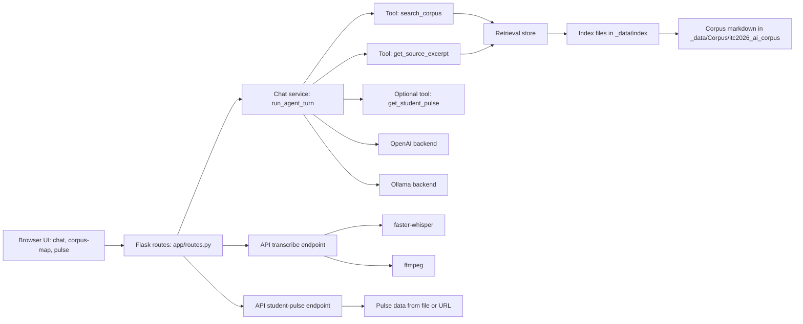

# Agent Broncos — CPP ITC AI Competition

Agent Broncos is a Flask app that answers Cal Poly Pomona questions using:
- tool-calling chat (`/api/chat`)
- local FAISS retrieval over the CPP markdown corpus
- optional local speech-to-text (`/api/transcribe`) via `faster-whisper`

Default backend in `.env.example` is OpenAI. Ollama is also supported.

## Demo Video

[](https://youtu.be/dwWcijElnjc)

[Watch on YouTube](https://youtu.be/dwWcijElnjc)

Live deployment: [agent-broncos-itc-ai-competition.onrender.com/chat](https://agent-broncos-itc-ai-competition.onrender.com/chat)

## What Is In Use

| Area | Implementation |
|---|---|
| Web app | Flask + Jinja templates (`/chat`, `/corpus-map`, `/pulse`) |
| Chat orchestration | `app/services/chat.py` with tools `search_corpus`, `get_source_excerpt` (+ optional `get_student_pulse`) |
| Retrieval | FAISS (`faiss-cpu`) + sentence-transformers embeddings |
| Corpus source | `_data/Corpus/itc2026_ai_corpus/*.md` + `_data/Corpus/itc2026_ai_corpus/index.json` |
| Index artifacts | `_data/index/cpp_corpus.faiss`, `_data/index/cpp_corpus.meta.jsonl`, `_data/index/url_map.json` |
| STT | `faster-whisper` + `ffmpeg` |
| Optional pulse feed | JSON ingest/read via `/api/student-pulse` and `/api/student-pulse/ingest` |

## Architecture



## Quick Start

```bash
cd /workspaces/Brono-Agents-ITC-AI-Competition
python3 -m venv .venv
source .venv/bin/activate
pip install -r requirements.txt
cp .env.example .env
```

Build the index:

```bash
python scripts/build_index.py
```

Run the app:

```bash
python run.py
```

Open:
- `http://127.0.0.1:5000/chat`
- `http://127.0.0.1:5000/api/health`

## LLM Backend Configuration

### OpenAI (default)

In `.env`:
- `CPP_LLM_BACKEND=openai`
- `CPP_ALLOW_OPENAI=true`
- `OPENAI_API_KEY=...`
- optional `CPP_OPENAI_MODEL` (default: `gpt-5-mini`)

### Ollama

In `.env`:
- `CPP_LLM_BACKEND=ollama`
- `CPP_ALLOW_OPENAI=false`
- `OLLAMA_BASE_URL=http://127.0.0.1:11434` (or your remote/cloud endpoint)
- `OLLAMA_MODEL=<installed tag>` (example `gemma3:4b`)
- `OLLAMA_API_KEY` only when your Ollama endpoint requires auth

## Speech-to-Text (Optional, Implemented)

`POST /api/transcribe` is enabled in code. Requirements:
- Python package `faster-whisper` (already in `requirements.txt`)
- system `ffmpeg` on PATH

Useful env vars:
- `CPP_WHISPER_MODEL_SIZE` (default `base`, use `tiny` for lighter dev)
- `CPP_WHISPER_DEVICE` (`cpu` or `cuda`)
- `CPP_WHISPER_COMPUTE_TYPE` (default `int8`)
- `CPP_WHISPER_WARMUP=true` to preload on health check

## Pulse Feed (Optional, Implemented)

Supported and wired:
- `GET /api/student-pulse`
- `POST /api/student-pulse/ingest` (requires `CPP_PULSE_INGEST_SECRET`)
- `CPP_ENABLE_PULSE_TOOL=true` to expose `get_student_pulse` to chat

Primary schema: `integrations/pulse_schema.json`.

- **`links`** in the schema (and optional ingest payload) drive the **Campus links** strip on the home dashboard (`GET /api/dashboard` includes `campus_links`).
- **Reddit titles** merge from Reddit’s public JSON when `CPP_PULSE_REDDIT_LIVE_FETCH` is true (default). Many cloud IPs get **HTTP 403** from Reddit; set **`CPP_PULSE_REDDIT_LIVE_FETCH=false`** and push `reddit_cpp.items` via **`POST /api/student-pulse/ingest`** from n8n/cron on a network Reddit allows (see `.env.example` for a minimal JSON example). Use **`CPP_PULSE_INGEST_SECRET`** and HTTPS only.

### Home dashboard defaults

- **News:** `CPP_DASHBOARD_RSS_NEWS` defaults to Polycentric (`retrieval/config.py` → `DEFAULT_DASHBOARD_RSS_NEWS`).
- **Events:** `CPP_DASHBOARD_MYBAR_ICS` defaults to **`https://mybar.cpp.edu/events.ics`** when unset. Set `CPP_DASHBOARD_MYBAR_ICS=` (empty) to disable MyBar pulls.

### UI translation (home + other pages)

- Set **`Agent_Broncos_Language_Translation`** so **`POST /api/translate/batch`** can translate `data-i18n` labels.
- After changing template copy, regenerate static bundles (optional, speeds up non-English loads):  
  `python3 scripts/build_ui_i18n_bundles.py`  
  (requires the Langbly key in the environment when you run it.)

## Retrieval Evaluation

After index build:

```bash
python scripts/golden_eval.py
```

Writes `_data/eval_results.json` from `_data/golden_questions.json`.

## Key Endpoints

| Path | Purpose |
|---|---|
| `GET /api/health` | backend/index/STT/pulse readiness details |
| `POST /api/chat` | chat with tool-calling over corpus |
| `GET /api/retrieve?q=...` | direct retrieval debugging |
| `POST /api/transcribe` | audio to text |
| `GET /api/student-pulse` | pulse JSON |
| `POST /api/student-pulse/ingest` | authenticated pulse ingest |
| `GET /api/dashboard` | aggregated RSS/ICS + pulse cards |
| `GET /weather` (or `/api/weather`) | OpenWeatherMap current weather |
| `POST /translate` (or `/api/translate`) | Langbly text translation |
| `GET /api/stats` | anonymous usage counters |

## Project Data Layout

| Path | Contents |
|---|---|
| `_data/Corpus/itc2026_ai_corpus/` | source markdown corpus + `index.json` |
| `_data/index/` | generated FAISS + metadata files |
| `_data/golden_questions.json` | retrieval eval fixtures |
| `_data/eval_results.json` | eval output |

## Database 

The system uses a hybrid data approach instead of a traditional relational database like PostgreSQL. Core data retrieval is powered by FAISS, which stores embeddings of the corpus and enables fast semantic search.

User queries are converted into embeddings and matched against the FAISS index to retrieve the most relevant document chunks, which are then passed to the LLM for response generation. The original content is stored as markdown files with accompanying JSON metadata.

For lightweight structured data (e.g., the pulse feed), the system uses JSON-based storage instead of a full database.

## Features

- Implemented a language translation module using the Langbly API to support multilingual user queries (set `Agent_Broncos_Language_Translation`)
- Integrated the OpenWeather API to display real-time weather data within the application dashboard (set `Agent_Broncos_Weather_API`)
